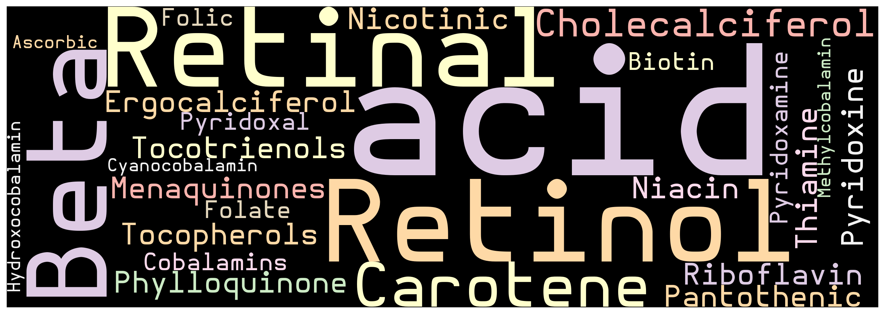

> Roles of vitamins extend beyond mere nutrient support; they are integral cofactors in metabolic pathways, crucial for the synthesis of enzymes, hormones, and other molecular compounds critical for life.

## **Vitamins Overview**

Vitamins are categorized into two types based on their solubility: fat-soluble vitamins (A, D, E, K) and water-soluble vitamins (C and all B vitamins). Each vitamin has unique molecular structures and functions.

- **Fat-Soluble Vitamins**

  - **Vitamin A (Retinol)**
    - **Molecular Role**: Vitamin A is crucial for vision as it is a component of rhodopsin, a protein in the eye that absorbs light in the retinal receptors. It also plays a vital role in gene transcription, immune function, and skin health.
    - **Sources**: Found in liver, carrots, and fortified foods.
    - **Deficiency**: Can lead to night blindness and increased susceptibility to infections.
  - **Vitamin D (Calciferol)**
    - **Molecular Role**: Vitamin D is essential for calcium and phosphorus homeostasis, influencing bone health and immune function. It is converted in the body to calcitriol, the biologically active form of the vitamin, which helps regulate gene expression through vitamin D receptors.
    - **Sources**: Synthesized in the skin from sunlight; found in fatty fish and fortified dairy products.
    - **Deficiency**: Leads to rickets in children and osteomalacia in adults.
  - **Vitamin E (Tocopherol)**
    - **Molecular Role**: Acts as an antioxidant, protecting cell membranes from oxidative damage by neutralizing free radicals.
    - **Sources**: Vegetable oils, nuts, and seeds.
    - **Deficiency**: Rare but can cause hemolytic anemia in newborns.
  - **Vitamin K (Phylloquinone and Menaquinones)**
    - **Molecular Role**: Essential for the post-translational modification of certain proteins required for blood clotting. Also involved in bone metabolism.
    - **Sources**: Leafy green vegetables, some fermented foods.
    - **Deficiency**: Leads to increased bleeding time.

- **Water-Soluble Vitamins**
  - **Vitamin C (Ascorbic Acid)**
    - **Molecular Role**: Important for the synthesis of collagen, a vital structural protein in connective tissues. Acts as a potent antioxidant and plays a role in immune function.
    - **Sources**: Citrus fruits, strawberries, bell peppers.
    - **Deficiency**: Scurvy, characterized by bleeding gums, bruising, and poor wound healing.
  - **B Vitamins**
    - **Vitamin B1 (Thiamine)**: Essential for glucose metabolism and plays a critical role in nerve, muscle, and heart function.
    - **Vitamin B2 (Riboflavin)**: Important for energy production and cellular function, growth, and development.
    - **Vitamin B3 (Niacin)**: Essential for the digestive system, skin, and nerves to function properly; also important in converting food to energy.
    - **Vitamin B5 (Pantothenic Acid)**: Vital for fatty acid synthesis and metabolism.
    - **Vitamin B6 (Pyridoxine)**: Crucial for protein, fat, and carbohydrate metabolism and the creation of neurotransmitters and red blood cells.
    - **Vitamin B7 (Biotin)**: Important for carbohydrate and fat metabolism and regulates gene expression.
    - **Vitamin B9 (Folate)**: Essential for proper brain function and plays a critical role in mental and emotional health.
    - **Vitamin B12 (Cobalamin)**: Necessary for red blood cell formation, neurological function, and DNA synthesis.
