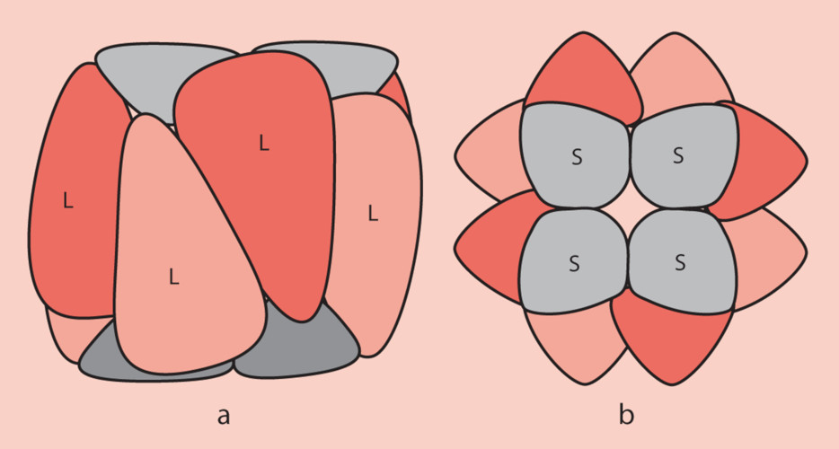

## Intro

RuBisCO, which stands for `Ribulose-1,5-bisphosphate carboxylase/oxygenase`, is a crucial enzyme in the process of photosynthesis, primarily responsible for the fixation of atmospheric carbon dioxide into organic molecules. It is the most abundant protein on Earth due to its central role in carbon fixation, supporting the vast majority of life by contributing to the global carbon cycle.

RuBisCO, the enzyme essential for photosynthesis in organisms, comprises an L8S8 structure with eight large subunits (L) and eight small subunits (S). Each large subunit weighs between 51 and 58 kDa, while each small subunit ranges from 12 to 18 kDa (see Figure 1). The large subunits are synthesized within the chloroplast stroma and are encoded by the chloroplast genome. In contrast, the small subunits are encoded by the nuclear genome of photosynthetic cells. After their synthesis, these small subunits are transported into the chloroplast stroma, passing through the chloroplast's outer and inner membranes. The proper folding and assembly of these subunits into the functional RuBisCO enzyme require the assistance of chaperone proteins. Functionally, the large subunits contain the catalytic sites essential for activity, while the small subunits play a crucial regulatory role in the enzyme's operation.

### C3 Plants

C3 plants are the most common type of photosynthetic plant. In C3 photosynthesis, carbon dioxide is fixed directly into a three-carbon compound, 3-phosphoglycerate, by the enzyme RuBisCO. This process occurs in the chloroplasts of the leaf mesophyll cells. C3 photosynthesis is straightforward but not very efficient under high temperature and low carbon dioxide conditions because RuBisCO also reacts with oxygen, leading to a wasteful process called photorespiration.

### C4 Plants

C4 plants have evolved a mechanism to efficiently capture carbon dioxide, even under low concentrations, which is advantageous in hot and dry environments. In these plants, carbon dioxide is initially fixed into a four-carbon compound, oxaloacetate, which is converted into malate or aspartate. This initial reaction is catalyzed by the enzyme phosphoenolpyruvate carboxylase (PEPC), which has a higher affinity for CO2 and does not react with oxygen. This four-carbon compound is then shuttled to specialized bundle sheath cells, where the CO2 is released and re-fixed by RuBisCO into the C3 pathway. This spatial separation of the initial and final carbon fixation steps reduces photorespiration and increases photosynthetic efficiency under high light intensity and temperature.

### CAM Plants

CAM (Crassulacean Acid Metabolism) plants have adapted to extremely arid conditions by fixing carbon dioxide at night when the stomata (leaf pores) can be open with less water loss. During the night, CAM plants fix CO2 into organic acids (like malate) and store them in vacuoles. During the day, the stomata close to conserve water, and the stored CO2 is released from the organic acids for use in the Calvin cycle (the same cycle used by C3 and C4 plants). This temporal separation of CO2 uptake and fixation allows CAM plants to photosynthesize during the day with minimal water loss.
