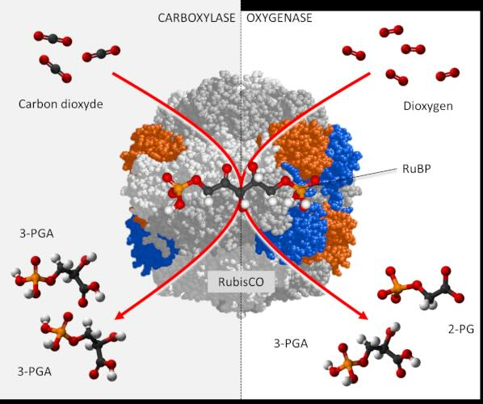
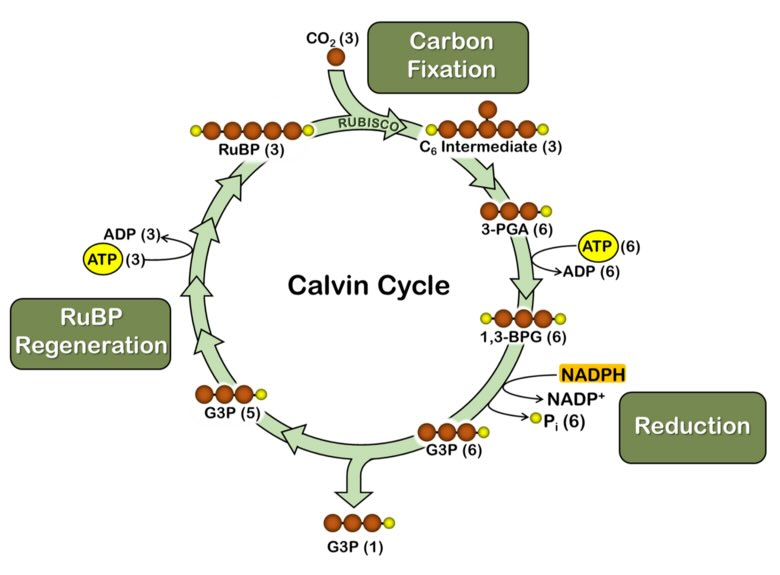
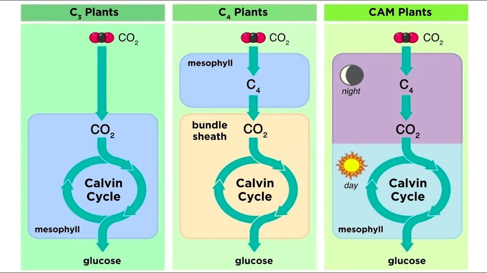
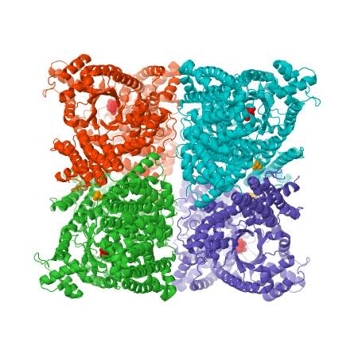

## Intro

RuBisCO, which stands for `Ribulose-1,5-bisphosphate carboxylase/oxygenase`, is a crucial enzyme in the process of photosynthesis, primarily responsible for the fixation of atmospheric carbon dioxide into organic molecules. It is the most abundant protein on Earth due to its central role in carbon fixation, supporting the vast majority of life by contributing to the global carbon cycle.

RuBisCO, the enzyme essential for **photosynthesis** in organisms, comprises an `L8S8` structure with eight _large_ subunits (L) and eight _small_ subunits (S). Each large subunit weighs between 51 and 58 kDa, while each small subunit ranges from 12 to 18 kDa (see Figure 1). The large subunits are synthesized within the `chloroplast stroma` and are encoded by the chloroplast genome. In contrast, the small subunits are encoded by the nuclear genome of photosynthetic cells. After their synthesis, these small subunits are transported into the `chloroplast stroma`, passing through the chloroplast's outer and inner membranes. The proper folding and assembly of these subunits into the functional RuBisCO enzyme require the assistance of chaperone proteins. Functionally, the large subunits contain the catalytic sites essential for activity, while the small subunits play a crucial regulatory role in the enzyme's operation.

### RuBisCo

RubisCO is a `carboxylase` _(an enzyme that catalyzes the addition of a carboxyl ROOH group to a specified substrate)_.

> RuBisCO catalyzes the **first** major step of the Calvin cycle in photosynthesis. This step involves the attachment of carbon dioxide to `ribulose-1,5-bisphosphate` (RuBP), a _five-carbon sugar_, to form two molecules of `3-phosphoglycerate`, a _three-carbon compound_. This reaction is crucial for the synthesis of sugars that plants use for energy and growth.

**Challenges with RuBisCO**

_Despite its essential role_, RuBisCO is _NOT_ particularly efficient or selective. It can also catalyze the reaction of oxygen with RuBP, leading to a process called `photorespiration`, which is energetically wasteful for the plant. Photorespiration consumes oxygen and releases carbon dioxide, essentially undoing some of the work of photosynthesis. This inefficiency is particularly problematic under conditions of high temperature and low carbon dioxide concentrations.

## The Calvin Cycle

> The Calvin Cycle, also known as the Calvin-Benson-Bassham (CBB) cycle, is a series of biochemical redox reactions that take place in the `stroma` of `chloroplasts` in photosynthetic organisms. This cycle is the primary pathway for **carbon fixation**, converting atmospheric carbon dioxide into organic molecules like glucose. It is named after Melvin Calvin, who was one of the first to elucidate its steps.

### Overview of the Calvin Cycle

The Calvin Cycle is a crucial part of photosynthesis and can be divided into three main phases: carbon fixation, reduction, and regeneration of the starting molecule, ribulose-1,5-bisphosphate (RuBP). Unlike the light reactions of photosynthesis, which convert solar energy into chemical energy, the Calvin Cycle uses the chemical energy (ATP and NADPH) produced during these reactions to fix carbon and synthesize sugars.

### Phases

**Carbon Fixation:**

- Enzyme Involved: Ribulose-1,5-bisphosphate carboxylase/oxygenase (`RuBisCO`).
- Process: Carbon dioxide (CO₂) from the atmosphere is attached to RuBP, a five-carbon sugar, resulting in a six-carbon compound that immediately splits into two molecules of 3-phosphoglycerate (`3-PGA`), a three-carbon compound.

**Reduction Phase:**

- Energy Used: `ATP` and `NADPH`.
- Process: Each 3-PGA molecule is phosphorylated by ATP, then reduced by NADPH to form glyceraldehyde 3-phosphate (G3P), a three-carbon sugar. This is the point at which the inorganic carbon (CO₂) is converted into an organic form (G3P) that can eventually be turned into glucose.
- Outcome: For every three turns of the cycle, five G3Ps are used to regenerate RuBP, and one G3P is output from the cycle, which contributes to forming glucose and other carbohydrates.

**Regeneration of RuBP:**

- Energy Used: ATP.
- Process: The remaining five G3P molecules undergo a series of transformations involving multiple enzyme-catalyzed reactions that consume ATP. This series of reactions regenerates three molecules of RuBP, allowing the cycle to prepare for the next CO₂ fixation.
- Outcome: The cycle is now ready to fix more CO₂, continuing the process of sugar production.

## Types of Plants

### Overview

**C3 plants** are the **_most common_** type of photosynthetic plant. In C3 photosynthesis, carbon dioxide is fixed _directly_ into a _three-carbon compound_, `3-phosphoglycerate`, by the enzyme `RuBisCO`. This process occurs in the chloroplasts of the leaf mesophyll cells. C3 photosynthesis is _not very efficient under high temperature and low carbon dioxide conditions_ because of the carboxylase/oxygenase nature of `RuBisCO` (see the first section).

**C4 plants** have evolved a mechanism to efficiently capture carbon dioxide, even under low concentrations, which is advantageous _in hot and dry environments_. In these plants, carbon dioxide is initially fixed into a four-carbon compound, `oxaloacetate`, which is converted into `malate` or `aspartate`. This initial reaction is catalyzed by the enzyme `phosphoenolpyruvate carboxylase` (PEPC) (_higher_ affinity for CO2 and does _NOT_ react with oxygen). This four-carbon compound is then shuttled to _specialized_ **bundle sheath cells**, where the CO2 is released and re-fixed by `RuBisCO` into the C3 pathway. This **_spatial_** separation of the initial and final carbon fixation steps reduces photorespiration and increases photosynthetic efficiency under high light intensity and temperature.

**CAM** _(Crassulacean Acid Metabolism)_ plants have adapted to _extremely arid conditions_ by fixing carbon dioxide at night _when the stomata (leaf pores) can be open with less water loss_. During the night, CAM plants fix CO2 into organic acids (like malate) and store them in vacuoles (vacuoles are membrane-bound sacs within the cytoplasm of a cell). During the day, the stomata _close_ to conserve water, and the stored CO2 is released from the organic acids for use in the Calvin cycle (the same cycle used by C3 and C4 plants). This **_temporal_** separation of CO2 uptake and fixation allows CAM plants to photosynthesize during the day with minimal water loss.

### Phosphoenolpyruvate carboxylase (`PEPC`)

> PEPC (a.k.a PEP carboxylase, PEPCase) is a highly conserved enzyme among C4 and CAM plants, and it operates as a `homotetramer`, meaning it consists of `four` identical subunits. Each subunit has a molecular weight ranging approximately from 100 to 110 kDa. The enzyme has a bi-lobed structure, with each lobe contributing to a large cleft that forms the active site. The structure of PEPC is designed to allow the substrate, phosphoenolpyruvate (PEP), and the bicarbonate ion to be precisely positioned for the catalytic reaction to occur.

PEPC is **_NOT_** a simple enzyme but a complex one that requires various factors for its activation:

- **Magnesium Ions (Mg²⁺)**: Essential for enzymatic activity, Mg²⁺ binds to the enzyme along with bicarbonate, facilitating the conversion of PEP to oxaloacetate.
- **Malate and Aspartate**: These organic acids are feedback inhibitors of PEPC. High concentrations of these acids (which are products of the reaction that PEPC catalyzes in C4 photosynthesis) inhibit the enzyme, thus regulating the rate of carbon fixation and preventing the over-accumulation of oxaloacetate.
- **Phosphorylation**: PEPC activity is also regulated through phosphorylation by a specific kinase (PEPC kinase), which increases its affinity for PEP and reduces sensitivity to malate. This post-translational modification is crucial for the light-dependent regulation of PEPC activity in C4 and CAM plants.

### Stoichiometry

**C3 Pathway Stoichiometry**

- **Carbon Fixation**: For each CO₂ molecule fixed, one molecule of 3-phosphoglycerate (3-PGA) is formed.
- **Overall Reaction**: $$3 \text{CO}_2 + 9 \text{ATP} + 6 \text{NADPH} \rightarrow \text{G3P} + 9 \text{ADP} + 8 \text{P}_i + 6 \text{NADP}^+ + 3 \text{H}_2\text{O}
$$
- **Net Gain**: For every three molecules of CO₂ fixed, one molecule of glyceraldehyde-3-phosphate (G3P) is produced, which can exit the cycle to contribute to glucose synthesis. Six molecules of G3P are required to form one glucose molecule, thus requiring six turns of the cycle.

**C4 Pathway Stoichiometry**

- **Initial Carbon Fixation**: For every CO₂ molecule fixed into oxaloacetate (and then malate or aspartate), one molecule of phosphoenolpyruvate (PEP) is used.
- **C4 to C3 Transfer**: Each molecule of CO₂ released from malate in the bundle sheath cells is then refixed by the C3 pathway.
  $$
  5 \text{CO}_2 + 2 \text{ATP} \rightarrow 3 \text{RuBP} + 2 \text{ADP} + 2 \text{P}_i + 3 \text{H}_2\text{O}
  $$

**Note**: This reflects the additional ATP cost in the C4 cycle for pumping CO₂ into the bundle sheath cells, where it is then fixed by the C3 cycle.

**CAM Pathway Stoichiometry**

- **Nighttime CO₂ Fixation**: For each CO₂ molecule fixed, one molecule of malate (stored in vacuoles) is formed. This process uses PEP similar to the C4 pathway.
- **Daytime Decarboxylation and Refixation**：$$\text{Malate} \rightarrow \text{CO}_2 + \text{Pyruvate}; \quad \text{CO}_2 \text{ is then refixed via the C3 pathway.}
$$

**Energy Cost**: Similar to the C4 pathway, there is an additional energy cost associated with the nocturnal fixation and storage of CO₂.
