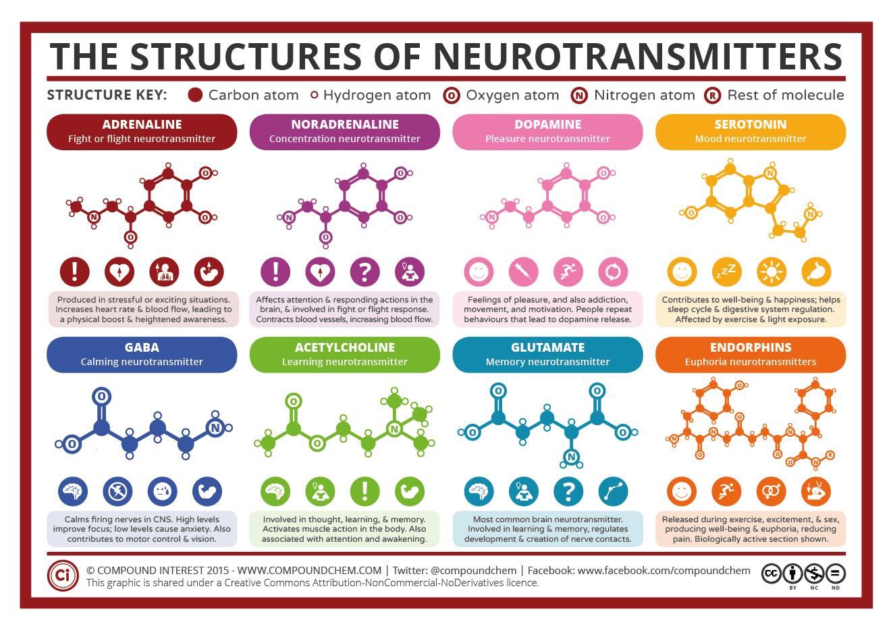

## Intro

> The regulation of mood in the human brain involves a complex `network` of neurological pathways, neurotransmitters, and brain regions.

### Brain Anatomy

1. **Forebrain** (Prosencephalon /ˌpräs-ˌen-ˈse-fə-ˌlän, -lən /)

> The forebrain is the largest and most complex part of the brain, comprising several key areas involved in advanced cognitive functions, emotional regulation, and sensory processing.

- **Cerebral Cortex**: The outermost layer of the brain, responsible for complex cognitive processes such as reasoning, language, and conscious thought. It is divided into four lobes:
  - _Frontal Lobe_: Involved in decision making, problem solving, planning, and parts of speech and movement control.
  - _Parietal Lobe_: Processes sensory information such as touch, temperature, and pain, and is involved in spatial orientation and manipulation.
  - _Occipital Lobe_: Primarily responsible for visual processing.
  - _Temporal Lobe_: Involved in auditory processing, memory, and integrating sensory input with emotional valence.
- **Limbic System**: A group of interconnected structures located deep within the brain, important for emotion, behavior, and memory. Key components include the amygdala, hippocampus, thalamus, and hypothalamus.
- **Basal Ganglia**: A group of nuclei that regulate movement, process information related to emotions, motivation, and reward.

2. **Midbrain** (Mesencephalon /ˌme-ˌzen-ˈse-fə-ˌlän, ˌmē-, -zən-, -ˌsen-, -sən-, -lən /)

> The midbrain is a small part of the brainstem that acts as a relay station between various parts of the nervous system, including auditory, visual, and motor systems.

- _Tectum_: Involved in auditory and visual reflexes.
- _Tegmentum_ (/teg-ˈmen-təm /): Contains structures that are crucial for eye movement, body movement, and regulating arousal.

3. **Hindbrain** (Rhombencephalon /ˌräm-(ˌ)ben-ˈse-fə-ˌlän, -lən/)

> The hindbrain is critical for maintaining vital bodily functions and includes the following structures:

- _Cerebellum_: Helps in maintaining balance, coordinating movement, and fine motor control. It also plays roles in motor learning and cognitive functions.
- _Pons_: A bridge between various parts of the brain, involved in motor control and sensory analysis. It also plays a role in sleep and dreaming.
- _Medulla Oblongata_ /mə-ˈdə-lə / /-ˌä-ˌblȯŋ-ˈgä-tə/: Controls autonomic functions such as breathing, heart rate, and digestion.

4. **Brainstem**

> Connects the brain to the spinal cord, the brainstem is composed of the midbrain, pons, and medulla oblongata. It is essential for regulating basic life functions such as breathing, heart rate, and blood pressure.

5. **Ventricular System** /ven-ˈtri-kyə-lər, vən- /

- **Ventricles** /ˈventrɪkl/: Cavities within the brain that produce and transport cerebrospinal fluid, which cushions the brain and spinal cord.

### Limbic System

This group of interconnected structures in the brain is crucial for emotion regulation. Major components include the amygdala, hippocampus, and parts of the thalamus.

1. **Medial Temporal Lobe**

- **Hippocampus**: Located in the medial temporal lobe, the hippocampus is crucial for the formation and retrieval of memories. It plays a significant role in how memories are associated with emotions, which affects mood regulation.
- **Amygdala**: Also situated in the medial temporal lobe, the amygdala is key for emotional processing. It reacts to emotional stimuli and is involved in generating responses to potential threats, influencing fear and other emotions.

2. **Subcortical Structures**

- **Hypothalamus**: Though technically not always classified strictly within the limbic system, the hypothalamus, located below the thalamus, plays a critical role in regulating autonomic and endocrine functions in response to emotional stimuli. It helps maintain homeostasis and is involved in emotional responses through hormonal secretion.

3. **Cingulate Cortex** ['sɪŋgjəleɪt]

- **Anterior Cingulate Cortex (ACC)**: Located just above the corpus callosum, the ACC is involved in cognitive functions such as decision-making, empathy, impulse control, and emotion. It’s important for assessing the emotional outcome of actions and resolving conflicts between internal goals and external demands.

4. **Other Associated Areas**

- **Parahippocampal Gyrus** /'dʒaɪrəs/: Surrounding the hippocampus, this region is involved in memory encoding and retrieval. It plays a role in spatial memory and navigation, which can be emotionally relevant in certain contexts.
- **Olfactory Bulb**: Involved in the sense of smell, the olfactory bulb has direct connections to the amygdala and hippocampus, linking smells with emotional memories, although it's often less emphasized in discussions about the core limbic structures.

### Prefrontal Cortex (PFC)

The `PFC` is _crucial_ for _cognitive_ aspects of mood regulation, such as judgment, decision-making, and problem-solving. Different parts of the PFC have specific roles:

- **Orbitofrontal Cortex (OFC)**: Involved in the evaluation of risks and rewards and in controlling impulsive behavior.
- **Dorsolateral** /dɔ:səʊ'lætərəl/ **Prefrontal Cortex (DLPFC)**: Associated with the management of emotional responses through connections with the limbic system, playing a key role in mood disorders.

### Neurotransmitters

These chemical messengers are pivotal in mood regulation. Key neurotransmitters include:
Serotonin: Often linked to feelings of well-being and happiness. Low levels of serotonin are commonly associated with mood disorders like depression.

Neurotransmitters are chemical messengers that transmit signals across a chemical synapse from one neuron (nerve cell) to another 'target' neuron, muscle cell, or gland cell. They are crucial in shaping everyday life and functions. Here’s an organized look into various types of neurotransmitters and their roles:

1. **Amino Acids**

These neurotransmitters are derived from amino acids and play pivotal roles in the central nervous system.

- **Glutamate**
  - _Role:_ The primary excitatory neurotransmitter in the central nervous system. It is essential for neural communication, memory formation, and learning.
- **GABA (Gamma-Aminobutyric Acid)**
  - _Role:_ The main inhibitory neurotransmitter in the brain. It helps reduce neuronal excitability throughout the nervous system.

2. **Monoamines**

These are neurotransmitters and neuromodulators containing one amino group connected to an aromatic ring by a two-carbon chain.

- **Dopamine**
  - _Role:_ Involved in reward, motivation, and motor control. Dysregulation is linked to Parkinson's disease and schizophrenia.
- **Norepinephrine (Noradrenaline)** (_[ˌnɔ:repɪ'nefrɪn]_)
  - _Role:_ Affects attention and responding actions in the brain. It plays a role in mood disorders and is critical for the fight-or-flight response in the face of danger.
- **Serotonin**
  - _Role:_ Modulates mood, emotion, sleep, and appetite. Its imbalance is associated with depression, anxiety, and other mood disorders.
- **Histamine**
  - _Role:_ Plays a role in the sleep-wake cycle and alertness, also involved in inflammatory response.

3. **Acetylcholine**

- _Role:_ Involved in muscle activation, memory, and alertness. It is significant in conditions like Alzheimer's disease, where there is a noted deficit of acetylcholine.

4. **Peptides**

These are short chains of amino acid monomers linked by peptide bonds.

- **Substance P**
  - _Role:_ Mediates pain perception and is involved in the stress response.
- **Opioid Peptides**
  - _Group Includes:_ Endorphins(_[enˈdɔ:fɪn]_), enkephalins (_|ɛnˈkɛfəlɪn|_), and dynorphins (_[dɪ'nɔ:rfɪn]_).
  - _Role:_ Natural painkillers, they play key roles in pain relief, reward, and addiction processes.

5. **Purines**

- **Adenosine** (_[ə'denəsi:n]_)
  - _Role:_ Generally acts as a neuromodulator in the brain. It is important in promoting sleep and suppressing arousal.

6. **Gases**

These neurotransmitters are unique because they are not stored in synaptic vesicles and are synthesized on demand.

- **Nitric Oxide (NO)**
  - _Role:_ Involved in smooth muscle relaxation in blood vessels, as well as in neurotransmission and immune responses.
- **Carbon Monoxide (CO)**
  - _Role:_ Similar functions to nitric oxide, influencing neurotransmission and vasodilation.

### More

**Hypothalamic-Pituitary-Adrenal (HPA) Axis**

This system controls reactions to stress and regulates many body processes, including mood. Dysregulation of the HPA axis has been linked to several mood disorders.

**Neural Circuits**

The connections between the PFC, amygdala, hippocampus, and other areas like the striatum and nucleus accumbens are integral in mood and emotional regulation. Disruptions or imbalances in these circuits can lead to mood disorders.

## Neurotransmitters and Psychological Disorders

Neurotransmitters play crucial roles in the brain's function and are directly implicated in various psychological disorders. The DSM-5 outlines several mental health conditions, many of which have been linked to dysregulations or imbalances in specific neurotransmitters.

### 1. **Serotonin**

- **Disorders Associated:**
  - **Depression:** Often associated with low levels of serotonin.
  - **Anxiety Disorders:** Serotonin imbalance is also implicated in anxiety, phobias, and obsessive-compulsive disorder (OCD).
  - **Schizophrenia:** Some theories suggest that serotonin could modulate other neurotransmitter systems that are dysfunctional in schizophrenia.

### 2. **Dopamine**

- **Disorders Associated:**
  - **Schizophrenia:** High levels of dopamine activity in certain brain regions are believed to contribute to psychosis.
  - **Parkinson’s Disease:** Marked by low dopamine levels, affecting motor control.
  - **Attention Deficit Hyperactivity Disorder (ADHD):** Dopamine is involved in focus and attention; dysregulation may underlie ADHD.
  - **Bipolar Disorder:** Dysregulation of dopamine is noted during manic phases.

### 3. **Norepinephrine (Noradrenaline)**

- **Disorders Associated:**
  - **Depression:** Lowered levels of norepinephrine have been linked to depression.
  - **Anxiety Disorders:** High levels can contribute to anxiety states, including panic disorder.

### 4. **Gamma-Aminobutyric Acid (GABA)**

- **Disorders Associated:**
  - **Anxiety Disorders:** Low levels of GABA are associated with increased anxiety.
  - **Epilepsy:** GABA dysfunction is a factor in the susceptibility to seizures.

### 5. **Glutamate**

- **Disorders Associated:**
  - **Schizophrenia:** Thought to be involved due to its role in synaptic plasticity and neuron excitability.
  - **Mood Disorders:** Imbalances in glutamate have been observed in bipolar disorder and depression.

### 6. **Acetylcholine**

- **Disorders Associated:**
  - **Alzheimer’s Disease:** Characterized by a significant drop in acetylcholine levels, which affects cognitive functions.
  - **Dementia:** Besides Alzheimer's, other forms of dementia also involve acetylcholine deficits.

### 7. **Histamine**

- **Disorders Associated:**
  - **Schizophrenia:** Histamine pathways might influence arousal and cognitive functions in schizophrenia.

### 8. **Opioid Peptides**

- **Disorders Associated:**
  - **Substance Use Disorders:** Endorphins are involved in the reward pathways that are often hijacked by addictive substances.
