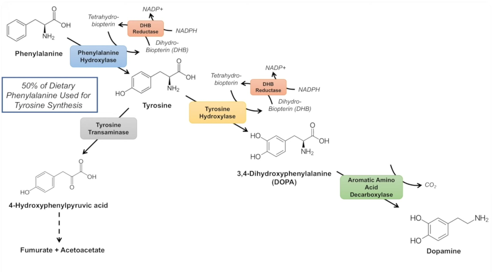
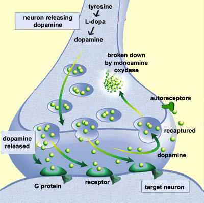
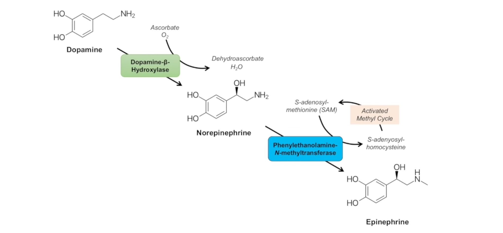
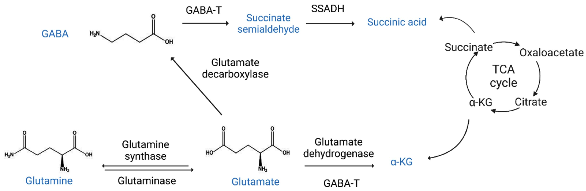
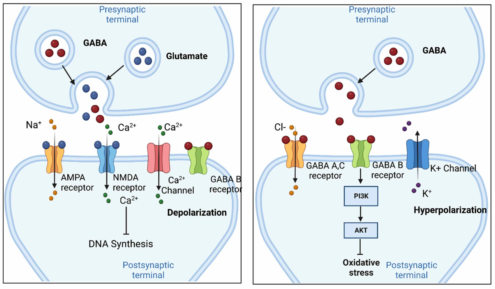
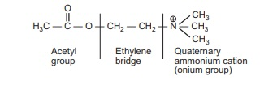
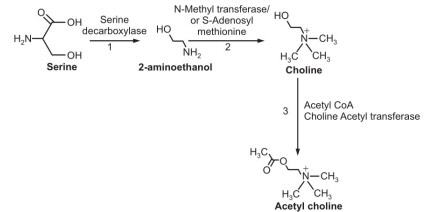
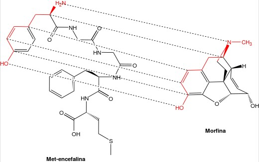

We have previously spent a good bit of time discussing [brain anatomy](../mood-and-neurotransmitter-pathways/#brain-anatomy) and [neurotransmitters](../mood-and-neurotransmitter-pathways/#neurotransmitters). This article takes our discussion on [neurotransmitters and psychological disorders](../mood-and-neurotransmitter-pathways/#neurotransmitters-and-psychological-disorders) even further.

## Intro and Revisit

Neurotransmitters are crucial chemical messengers in the brain that regulate a multitude of functions, from mood and behavior to physical coordination. Understanding their functions, the psychological disorders associated with their dysregulation, and how recreational drugs can influence these neurotransmitters offers comprehensive insights into both medical and social issues related to brain chemistry.

**_Serotonin_**

- **Functions:** Regulates mood, appetite, sleep, memory, and learning.
- **Disorders:** Depression, anxiety disorders, obsessive-compulsive disorder (OCD).
- **Recreational Drugs:**
  - **MDMA (Ecstasy):** Enhances serotonin release and inhibits its reuptake, leading to elevated mood and empathy.
  - **LSD (Lysergic acid diethylamide):** Acts on serotonin receptors, altering perception and feelings.

**_Dopamine_**

- **Functions:** Involved in reward, motivation, memory, attention, and even regulating body movements.
- **Disorders:** Parkinson's disease, schizophrenia, bipolar disorder, ADHD.
- **Recreational Drugs:**
  - **Cocaine:** Blocks the reuptake of dopamine, norepinephrine, and serotonin.
  - **Amphetamines (including methamphetamine):** Increase the release and block the reuptake of dopamine.

**_Norepinephrine_**

- **Functions:** Plays a role in alertness and arousal, response to stress, as well as learning and memory.
- **Disorders:** Depression, anxiety disorders, ADHD.
- **Recreational Drugs:**
  - **Cocaine:** Also affects norepinephrine, contributing to its stimulant effects.
  - **Amphetamines:** Enhance norepinephrine along with dopamine, promoting alertness and energy.

**_Gamma-Aminobutyric Acid (GABA)_**

- **Functions:** The primary inhibitory neurotransmitter in the brain, it helps to control nerve activity and calms nervous activity.
- **Disorders:** Anxiety disorders, epilepsy.
- **Recreational Drugs:**
  - **Alcohol:** Enhances the effects of GABA, leading to sedation and decreased anxiety.
  - **Benzodiazepines (illicit use or abuse):** Increase GABA activity, producing calming effects.

**_Glutamate_**

- **Functions:** The major excitatory neurotransmitter in the brain, it is critical for synaptic plasticity and a key player in learning and memory.
- **Disorders:** Alzheimer’s disease, ALS, Huntington's disease, and others related to neurotoxicity.
- **Recreational Drugs:**
  - **PCP (Phencyclidine) and Ketamine:** Act as NMDA receptor antagonists, affecting glutamate pathways and causing dissociative effects.

**_Acetylcholine_**

- **Functions:** Involved in promoting wakefulness, sustaining attention, memory, and also stimulates muscle contraction.
- **Disorders:** Alzheimer's disease, myasthenia gravis, dementia.
- **Recreational Drugs:**
  - **Nicotine:** Stimulates nicotinic acetylcholine receptors, affecting mood and muscle movement.

**_Opioid Peptides_**

- **Functions:** These endogenous opioids are important for pain relief, reward, and pleasure systems.
- **Disorders:** Opioid addiction and dependence.
- **Recreational Drugs:**
  - **Heroin and Other Opiates:** Mimic the effects of endorphins by binding to opioid receptors, producing euphoria and pain relief.

## Serotonin

> Serotonin, also known as 5-hydroxytryptamine (5-HT), is a monoamine neurotransmitter derived from the amino acid tryptophan. Its structure features an indole ring, a common motif in many natural and synthetic compounds, linked to an ethylamine chain. This structure is crucial for serotonin's ability to bind to and activate its receptors.

[img source](https://doi.org/10.3390/cancers13184532)

Serotonin synthesis begins with the amino acid `tryptophan`. `Tryptophan` is converted into `5-hydroxytryptophan` (5-HTP) by the enzyme `tryptophan hydroxylase`, which is a `rate-limiting step`. Subsequently, 5-HTP is decarboxylated by aromatic `L-amino acid decarboxylase` to produce `serotonin`. This pathway is influenced by various factors including diet and the availability of tryptophan.

### Serotonin & Other Naturally Occurring Compounds

- **Vitamins**: Vitamin B6 (pyridoxine) is a cofactor for the decarboxylase enzyme that converts 5-HTP to serotonin. Thus, adequate levels of vitamin B6 are essential for optimal serotonin production.
- **Amino Acids**: Tryptophan is the precursor to serotonin. Dietary intake of tryptophan-rich foods like turkey, eggs, and cheese can influence serotonin levels.

### Prescription Drugs & Serotonin

- **Selective Serotonin Reuptake Inhibitors** (SSRIs): Drugs such as fluoxetine and sertraline work by blocking the reuptake of serotonin into the presynaptic neuron. This increases the level of serotonin available to bind to the postsynaptic receptor, enhancing serotoninergic neurotransmission, which is beneficial in the treatment of depression and anxiety disorders.
- **Serotonin-Norepinephrine Reuptake Inhibitors** (SNRIs): Medications like venlafaxine and duloxetine block the reuptake of both serotonin and norepinephrine, amplifying the effects similar to SSRIs but with an added impact on norepinephrine pathways.
- **Monoamine Oxidase Inhibitors** (MAOIs): These drugs inhibit the activity of monoamine oxidase, an enzyme that breaks down serotonin in the brain, thereby increasing serotonin levels. However, they can interact with certain foods and other medications, which can lead to dangerous increases in blood pressure.

## Dopamine

Dopamine is crucial to systems related to reward, motivation, and motor control. Its chemical structure is `C8H11NO2`, making it a `catecholamine` (_[ka-teh-KOH-luh-meen]_), a class of molecules that includes other neurotransmitters like norepinephrine and epinephrine (_chemicals that are made by nerve cells and used to send signals to other cells_).

> The molecular structure of dopamine includes a benzene ring with two hydroxyl groups (catechol group) and an amine group attached via an ethyl chain.

[Image Source](https://www.youtube.com/watch?v=yuMP6lQ-Ueo)

**Biosynthesis of Dopamine:**
Dopamine is synthesized in the body through a two-step process primarily from the amino acid `tyrosine`, which is found in various protein-rich foods. The first step involves the conversion of tyrosine to `L-DOPA` (DOPA) by the enzyme tyrosine hydroxylase, which is a rate-limiting step and heavily influenced by feedback mechanisms related to the amount of dopamine already present in the system. `L-DOPA` is then decarboxylated to dopamine by the enzyme aromatic L-amino acid decarboxylase.

**Pathways and Mechanisms:**
Dopamine is stored in synaptic vesicles. When released into the synapse, it can bind to and activate `dopamine receptors`, which are `G-protein coupled receptors`. The binding of dopamine initiates a cascade of intracellular events that ultimately influence neuronal excitability, signal transduction, and transcription factors, thus affecting various physiological and psychological processes. The removal of dopamine from the synaptic cleft, which is crucial to cease its action, is primarily achieved by reuptake into the presynaptic neuron via the dopamine transporter (DAT) or by enzymatic breakdown by monoamine oxidase (MAO) and catechol-O-methyltransferase (COMT).

[Image Source](https://thebrain.mcgill.ca/flash/i/i_03/i_03_m/i_03_m_que/i_03_m_que.html)

**Relationship with Naturally Occurring Compounds:**

- Vitamin B6 is crucial in the synthesis of dopamine as it is a co-factor for the enzyme L-amino acid decarboxylase, influencing the conversion of L-DOPA to dopamine.
- Magnesium (`Mg`) plays a role in the activity of dopamine receptors by acting as a co-factor that supports the physiological configuration of these receptors. Omega-3 fatty acids, found in fish oils, have been linked to increased dopamine levels by potentially enhancing the dopamine receptors' sensitivity and facilitating synaptic plasticity.

**Prescription Drugs and Dopamine**

1. For Parkinson’s disease, Levodopa (L-DOPA), the direct precursor of dopamine, is administered to increase brain dopamine levels. Since dopamine cannot cross the blood-brain barrier, Levodopa is used because it can penetrate into the brain and is then converted to dopamine.
2. For psychiatric conditions, various antipsychotic drugs function by blocking dopamine receptors, especially D2 receptors, which helps in reducing psychotic symptoms including delusions and hallucinations.
3. Drugs like bupropion (an antidepressant) are effective by inhibiting the reuptake of dopamine (and norepinephrine), thereby increasing their concentration in the synaptic cleft and improving mood and attention.

## Norepinephrine

Norepinephrine, a.k.a noradrenaline, involves in the body’s fight-or-flight response and plays a crucial role in attention and decision-making processes.

> Norepinephrine has a benzene ring with two hydroxyl groups (the catechol structure) and a side chain ending in an amine group.

### Biosynthesis of Norepinephrine

From dopamine by the enzyme dopamine β-hydroxylase, occurs in the cytosol of noradrenergic neurons and in the adrenal medulla.

[Image Source](https://www.youtube.com/watch?v=yuMP6lQ-Ueo)

**Relationship with Naturally Occurring Compounds:**

Vitamin C is essential in the conversion process of dopamine to norepinephrine, as it is a required cofactor for dopamine β-hydroxylase. Without adequate vitamin C, the efficiency of this conversion can decrease, potentially impacting the levels of norepinephrine. Essential fatty acids, particularly omega-3s, are thought to enhance the fluidity of cell membranes, potentially improving the function of neuronal receptors including those for norepinephrine.

**Prescription Drugs and Their Mechanisms:**

- **Antidepressants**: Drugs like `SNRIs` (serotonin-norepinephrine reuptake inhibitors) such as `venlafaxine` and `duloxetine` work by blocking the reuptake of norepinephrine and serotonin, increasing their availability and activity in the brain. This is helpful in alleviating symptoms of depression and certain anxiety disorders.
- **Beta-blockers**: Used primarily in treating hypertension, beta-blockers like `propranolol` work by blocking norepinephrine’s action on beta-adrenergic receptors, thereby reducing heart rate and blood pressure.
- **Alpha-blockers**: Drugs such as `prazosin` work by blocking the action of norepinephrine at alpha receptors, primarily used to treat high blood pressure and symptoms of PTSD.

## Gamma-Aminobutyric Acid (GABA) & Glutamate

GABA is the primary `inhibitory` neurotransmitter, while Glutamate is the primary `excitatory` neurotransmitter.

- Glutamate: Structurally, it is a simple amino acid. It is synthesized from `alpha-ketoglutarate`, a key intermediate in the `Krebs cycle` (citric acid cycle, TCA cycle, tricarboxylic acid cycle).
  - Through transamination reactions facilitated by enzymes like aspartate aminotransferase. Glutamate can also convert to GABA, linking the metabolic pathways of these neurotransmitters.
- GABA: Directly synthesized from Glutamate by the enzyme glutamate decarboxylase, which requires pyridoxal phosphate (vitamin B6) as a cofactor.

[Image Source](https://www.mdpi.com/1422-0067/24/5/4584)

### Pathways

**Pathways and Mechanisms**

- **Glutamate** acts by binding to two main types of receptors: ionotropic (including NMDA, AMPA, and kainate receptors) and metabotropic glutamate receptors. These receptors facilitate the rapid transmission of excitatory signals across neurons, promoting calcium and sodium influx that leads to neuronal activation and synaptic plasticity.
- **GABA** interacts with $ \mathsf{\small{GABA\_{A} }}$ and $ \mathsf{\small{GABA\_{B} }}$ receptors. $ \mathsf{\small{GABA\_{A} }}$ receptors are ligand-gated ion channels that, when activated by GABA, allow chloride ions to flow into the neuron, making it less likely to fire. $ \mathsf{\small{GABA\_{B} }}$ receptors are G-protein coupled receptors that activate potassium channels and inhibit calcium channels, further promoting inhibition.

[Image Source](https://www.mdpi.com/1422-0067/24/5/4584)

**Removal and Recycling**

- **Glutamate** is taken up from the synaptic cleft by excitatory amino acid transporters on neurons and glial cells. Once inside cells, it can be converted back to glutamine by glutamine synthetase in glial cells and shuttled back to neurons.
- **GABA** is removed from the synapse by GABA transporters. Inside cells, GABA can be broken down by GABA transaminase into succinic semialdehyde, which enters the citric acid cycle.

> **Both** neurotransmitters are significantly influenced by `vitamin B6`, which is essential for the synthesis of GABA from Glutamate and for various enzymes in the metabolism of these neurotransmitters.

### Prescription Drugs

**Glutamate-Related**: Drugs such as Memantine and Ketamine target NMDA receptors to modulate the excitotoxic effects of glutamate in conditions like Alzheimer's and severe depression. Topiramate and Lamotrigine, used in epilepsy, affect both the release and the receptor activity of glutamate.

**GABA-Related**: Benzodiazepines enhance GABA's effect by increasing $ \mathsf{\small{GABA\_{A} }}$ receptor responsiveness, leading to increased inhibitory effects. This mechanism is used in the treatment of disorders like anxiety, epilepsy, and insomnia. Drugs like Vigabatrin increase GABA levels by inhibiting GABA transaminase, which breaks down GABA.

## Acetylcholine

Acetylcholine (ACh) is _vital_ in **central** and **peripheral** nervous systems (acetyl group linked to a choline molecule).

**Synthesis of Acetylcholine**: ACh is synthesized in nerve terminals from choline and acetyl-CoA. The enzyme choline acetyltransferase catalyzes this reaction, where choline is acetylated by acetyl-CoA, resulting in the production of ACh and coenzyme A. The choline required for this synthesis is partly obtained from the diet, particularly from foods rich in phosphatidylcholine, such as eggs, poultry, fish, and nuts.

[Image Source](https://www.pharmaguideline.com/2022/03/biosynthesis-and-catabolism-of-acetylcholine.html)

**Relationship with Naturally Occurring Compounds:**

- **Vitamins and Amino Acids**: **Vitamin B5** (_pantothenic acid_) is a component of coenzyme A and is essential for the synthesis of acetyl-CoA, thereby indirectly supporting the synthesis of ACh. Adequate levels of vitamin B1 (thiamine) are also necessary as it is involved in carbohydrate metabolism, providing the acetyl groups necessary for acetyl-CoA formation.
- **Fatty Acids**: Omega-3 fatty acids have been found to _increase_ acetylcholine levels by altering the composition of neuronal membranes and possibly affecting the function of acetylcholine receptors.

**Prescription Drugs Related to Acetylcholine**

1. **Cholinesterase Inhibitors**: Drugs like Donepezil, Rivastigmine, and Galantamine are used to treat Alzheimer’s disease by inhibiting acetylcholinesterase. This inhibition increases ACh levels in the brain, thereby enhancing cholinergic transmission to improve memory and cognitive functions in Alzheimer’s patients.
2. **Nicotinic Agonists**: Drugs like Varenicline, used for smoking cessation, act as partial agonists at nicotinic acetylcholine receptors. They mimic the action of acetylcholine at these receptors, reducing craving and withdrawal symptoms.
3. **Muscarinic Antagonists**: Drugs such as Atropine and Scopolamine block muscarinic acetylcholine receptors. They are used to increase heart rate, reduce bodily secretions during surgery, and as antidotes for certain poisonings.

## Opioid Peptides

Opioid peptides are a group of naturally occurring molecules in the brain and peripheral tissues.They are primarily known for their role in pain modulation, reward, and addictive behaviors.

**This part is rather complicated, will be in a separate in-depth article.**

**Pathways and Mechanisms**

- **Receptor Interaction**: Opioid peptides exert their effects by binding to opioid receptors, which are G-protein coupled receptors (`GPCRs`). There are three main types of opioid receptors: mu (μ), delta (δ), and kappa (κ), each with different affinities for various opioid peptides and distinct physiological effects.
  - Binding of opioid peptides to these receptors leads to inhibition of adenylate cyclase, decreased formation of cAMP, closure of voltage-gated calcium channels, and opening of potassium channels.
  - This results in reduced neuronal excitability and neurotransmitter release, primarily affecting pain signals and emotional responses.
- Degradation: Opioid peptides are rapidly broken down by enzymes such as aminopeptidases and endopeptidases, which limit their duration of action in the nervous system.

**Prescription Drugs Related to Opioid Peptides**

- **Agonists**: Drugs like morphine, heroin, and other synthetic opioids mimic the action of natural opioid peptides by binding to and activating opioid receptors. These are used for pain relief but are also associated with high addiction potential.
- **Antagonists**: Naloxone and naltrexone are opioid receptor antagonists that block the effects of both synthetic opioids and natural opioid peptides. They are used in the treatment of opioid overdose and to aid in recovery from opioid addiction by preventing relapse.

> Structural correlation between met-enkephalin, an opioid peptide (left), and morphine, an opiate drug (right)
