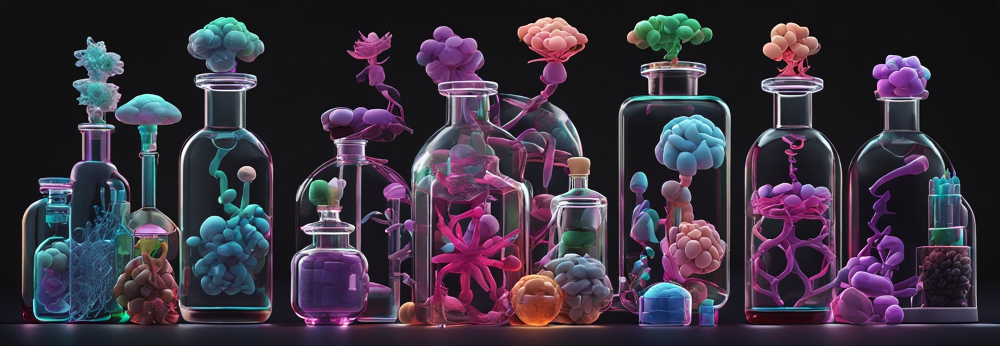
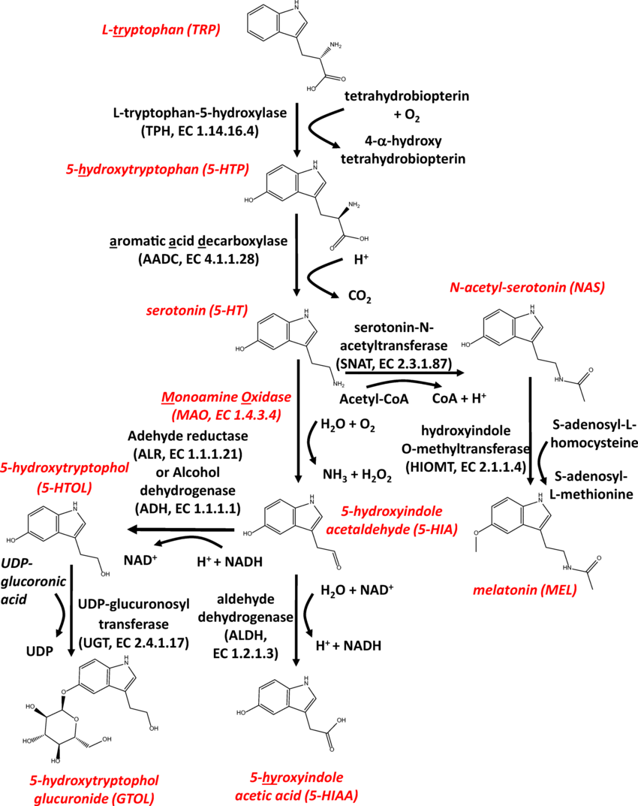

We have previously spent a good bit of time discussing [brain anatomy](../mood-and-neurotransmitter-pathways/#brain-anatomy) and [neurotransmitters](../mood-and-neurotransmitter-pathways/#neurotransmitters). This article takes our discussion on [neurotransmitters and psychological disorders](../mood-and-neurotransmitter-pathways/#neurotransmitters-and-psychological-disorders) even further.

## Intro and Revisit

Neurotransmitters are crucial chemical messengers in the brain that regulate a multitude of functions, from mood and behavior to physical coordination. Understanding their functions, the psychological disorders associated with their dysregulation, and how recreational drugs can influence these neurotransmitters offers comprehensive insights into both medical and social issues related to brain chemistry.

***Serotonin***

- **Functions:** Regulates mood, appetite, sleep, memory, and learning.
- **Disorders:** Depression, anxiety disorders, obsessive-compulsive disorder (OCD).
- **Recreational Drugs:**
  - **MDMA (Ecstasy):** Enhances serotonin release and inhibits its reuptake, leading to elevated mood and empathy.
  - **LSD (Lysergic acid diethylamide):** Acts on serotonin receptors, altering perception and feelings.

***Dopamine***

- **Functions:** Involved in reward, motivation, memory, attention, and even regulating body movements.
- **Disorders:** Parkinson's disease, schizophrenia, bipolar disorder, ADHD.
- **Recreational Drugs:**
  - **Cocaine:** Blocks the reuptake of dopamine, norepinephrine, and serotonin.
  - **Amphetamines (including methamphetamine):** Increase the release and block the reuptake of dopamine.

***Norepinephrine***

- **Functions:** Plays a role in alertness and arousal, response to stress, as well as learning and memory.
- **Disorders:** Depression, anxiety disorders, ADHD.
- **Recreational Drugs:**
  - **Cocaine:** Also affects norepinephrine, contributing to its stimulant effects.
  - **Amphetamines:** Enhance norepinephrine along with dopamine, promoting alertness and energy.

***Gamma-Aminobutyric Acid (GABA)***

- **Functions:** The primary inhibitory neurotransmitter in the brain, it helps to control nerve activity and calms nervous activity.
- **Disorders:** Anxiety disorders, epilepsy.
- **Recreational Drugs:**
  - **Alcohol:** Enhances the effects of GABA, leading to sedation and decreased anxiety.
  - **Benzodiazepines (illicit use or abuse):** Increase GABA activity, producing calming effects.

***Glutamate***

- **Functions:** The major excitatory neurotransmitter in the brain, it is critical for synaptic plasticity and a key player in learning and memory.
- **Disorders:** Alzheimer’s disease, ALS, Huntington's disease, and others related to neurotoxicity.
- **Recreational Drugs:**
  - **PCP (Phencyclidine) and Ketamine:** Act as NMDA receptor antagonists, affecting glutamate pathways and causing dissociative effects.

***Acetylcholine***

- **Functions:** Involved in promoting wakefulness, sustaining attention, memory, and also stimulates muscle contraction.
- **Disorders:** Alzheimer's disease, myasthenia gravis, dementia.
- **Recreational Drugs:**
  - **Nicotine:** Stimulates nicotinic acetylcholine receptors, affecting mood and muscle movement.

***Opioid Peptides***

- **Functions:** These endogenous opioids are important for pain relief, reward, and pleasure systems.
- **Disorders:** Opioid addiction and dependence.
- **Recreational Drugs:**
  - **Heroin and Other Opiates:** Mimic the effects of endorphins by binding to opioid receptors, producing euphoria and pain relief.

## Serotonin

> Serotonin, also known as 5-hydroxytryptamine (5-HT), is a monoamine neurotransmitter derived from the amino acid tryptophan. Its structure features an indole ring, a common motif in many natural and synthetic compounds, linked to an ethylamine chain. This structure is crucial for serotonin's ability to bind to and activate its receptors.

[img source](https://doi.org/10.3390/cancers13184532 )

### Serotonin & Other Naturally Occurring Compounds:

- **Vitamins**: Vitamin B6 (pyridoxine) is a cofactor for the decarboxylase enzyme that converts 5-HTP to serotonin. Thus, adequate levels of vitamin B6 are essential for optimal serotonin production.
- **Amino Acids**: Tryptophan is the precursor to serotonin. Dietary intake of tryptophan-rich foods like turkey, eggs, and cheese can influence serotonin levels.
